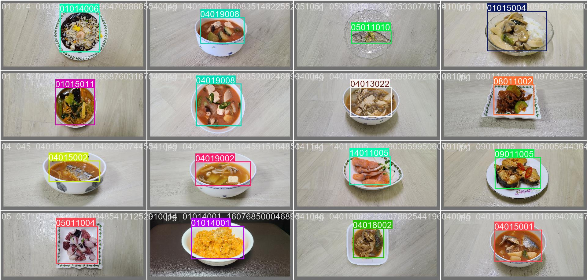
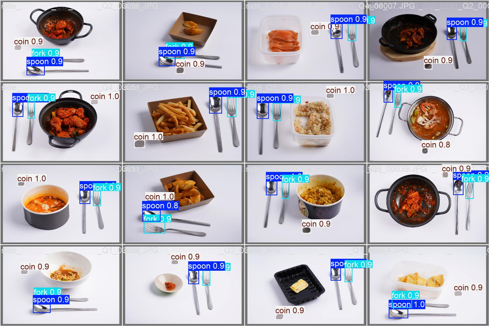

# 🍱 CareOn Food AI

### AI-Based Food Portion and Nutrition Analysis System

> 음식 사진 한 장으로 음식 종류를 인식하고 음식량 및 영양성분을 추정하는 AI 기반 식단 분석 시스템


---

## 📖 Overview

기존 식단 관리 서비스는 사용자가 음식명과 섭취량을 직접 입력해야 하는 불편함이 존재합니다.

CareOn Food AI는 음식 이미지를 입력받아 음식 종류를 인식하고, 기준물을 활용한 상대 면적 계산을 통해 음식량을 추정한 뒤 영양성분 정보를 제공하는 AI 기반 식단 분석 시스템입니다.

본 시스템은 YOLO 기반 음식 검출 모델과 기준물 검출 모델을 활용하며, AI Hub 음식 데이터셋과 영양 데이터베이스를 기반으로 음식량 및 영양 정보를 자동 산출합니다.

---

## 📊 Project Dataset Overview

| Item               | Value   |
| ------------------ | ------- |
| Food Classes       | 400     |
| Reference Classes  | 3       |
| Total Images       | 720,527 |
| Nutrition Database | AI Hub  |
| Portion Labels     | Q1 ~ Q5 |

---

## 🎬 Demo

<p align="center">
  
</p>

---

## 🎯 Project Goals

### 음식 자동 인식

YOLO 기반 객체 검출 모델을 활용하여 음식을 탐지합니다.

### 기준물 인식

숟가락, 포크, 동전 등의 기준물을 탐지합니다.

### 음식량 추정

음식과 기준물의 면적 비율을 이용하여 실제 섭취량을 추정합니다.

### 영양성분 계산

AI Hub 영양 데이터베이스를 활용하여 영양 정보를 제공합니다.

---

## 🏗 System Architecture

```text
Input Image
     │
     ▼
Food Detection Model
(YOLOv8s)
     │
     ▼
Reference Detection Model
(YOLOv8n)
     │
     ▼
Area Ratio Calculation
     │
     ▼
Q4 Reference Comparison
     │
     ▼
Portion Estimation
     │
     ▼
Weight Estimation
     │
     ▼
Nutrition Analysis
     │
     ▼
Result Visualization
```

---

## 🖥 Application Screen

### Main Screen


### Analysis Result


---

## ⚙️ Tech Stack

### AI / Deep Learning

* YOLOv8
* PyTorch
* Ultralytics

### Computer Vision

* OpenCV
* Pillow

### GUI

* CustomTkinter

### Data Processing

* NumPy
* JSON

---

## 📂 Project Structure

```text
CareOn_Food_AI/
│
├── app.py
├── requirements.txt
├── README.md
│
├── models/
│   ├── food_detection_model.pt
│   └── Reference_detection_model.pt
│
├── json/
│   ├── food_q4_reference.json
│   ├── category_q4_reference.json
│   └── food_nutrition_db.json
│
├── test_images/
│
└── docs/
    ├── demo.gif
    ├── main.png
    ├── result.png
    ├── food_model_results.png
    ├── reference_model_results.png
    ├── food_detection_example1.jpg
    └── food_detection_example2.jpg
```

---

## 🧠 AI Models

### Food Detection Model

| Item         | Value                       |
| ------------ | --------------------------- |
| Model        | YOLOv8s                     |
| Task         | Food Detection              |
| Classes      | 400                         |
| Total Images | 719,927                     |
| Train        | 698,085                     |
| Validation   | 15,842                      |
| Test         | 6,000                       |

### Reference Detection Model

| Item         | Value                       |
| ------------ | --------------------------- |
| Model        | YOLOv8n                     |
| Task         | Reference Object Detection  |
| Classes      | Spoon / Fork / Coin         |
| Total Images | 600                         |
| Train        | 500                         |
| Validation   | 50                          |
| Test         | 50                          |

---

## 📏 Portion Estimation Method

### Step 1. Food Area

```python
food_area_px = food_width * food_height
```

### Step 2. Reference Area

```python
utensil_area_px = utensil_width * utensil_height
```

### Step 3. Ratio Calculation

```python
ratio = food_area_px / utensil_area_px
```

### Step 4. Portion Scale

```python
amount_scale = ratio / q4_ratio
```

### Step 5. Weight Estimation

```python
weight_g = base_weight_g * amount_scale
```

---

## 📊 Nutrition Information

분석 결과로 다음 영양성분을 제공합니다.

| Category     | Unit |
| ------------ | ---- |
| Calories     | kcal |
| Carbohydrate | g    |
| Protein      | g    |
| Fat          | g    |
| Sodium       | mg   |
| Sugar        | g    |
| Calcium      | mg   |
| Potassium    | mg   |
| Magnesium    | mg   |
| Phosphorus   | mg   |
| Iron         | mg   |
| Zinc         | mg   |
| Cholesterol  | mg   |
| Trans Fat    | g    |

---

## 📚 Dataset

### AI Hub Food Dataset

활용 데이터

* 음식 이미지 데이터
* 음식 분량(Q1~Q5) 데이터
* 음식 영양 데이터베이스
* 기준물 이미지 데이터

---

## 📈 Performance

### Food Detection

| Metric    | Score |
| --------- | ----- |
| Precision | 87.7% |
| Recall    | 84.7% |
| mAP50     | 91.9% |
| mAP50-95  | 80.4% |

### Food Detection Training Result




---

### Reference Detection

| Metric    | Score  |
| --------- | ------ |
| Precision | 99.8%  |
| Recall    | 100.0% |
| mAP50     | 99.5%  |
| mAP50-95  | 80.3%  |

### Reference Detection Training Result




---

## 💡 Research Contribution

기존 음식 인식 연구는 주로 음식 종류 분류에 초점을 맞추고 있으나,

CareOn Food AI는

* 음식 검출
* 기준물 검출
* 음식량 추정
* 영양성분 분석

을 하나의 파이프라인으로 통합하였다.

또한 기준물 대비 상대 면적 비율과 AI Hub Q4 기준 데이터를 활용하여 음식의 실제 섭취량을 추정할 수 있도록 설계하였다.

---

## 🚀 Installation

### Clone Repository

```bash
git clone https://github.com/sunwoocodes/CareOn_Food_AI.git
cd CareOn_Food_AI
```

### Install Dependencies

```bash
pip install -r requirements.txt
```

---

## ▶ Run

```bash
python app.py
```

---

## ⚠️ Limitations

* Bounding Box 기반 면적 추정 방식 사용
* 음식 높이 정보 미반영
* 카메라 각도에 따른 오차 발생 가능
* 실제 중량과 차이가 발생할 수 있음

---

## 🔮 Future Work

* Segmentation 기반 음식 영역 추출
* 3D Volume Estimation
* 모바일 애플리케이션 연동
* 클라우드 기반 서비스 구축
* 개인 맞춤형 식단 추천 기능

---

## 📄 License

This project is intended for educational and research purposes only.
