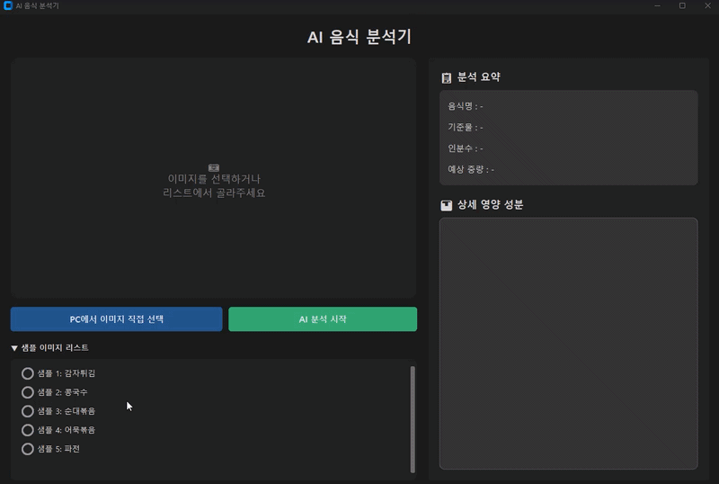
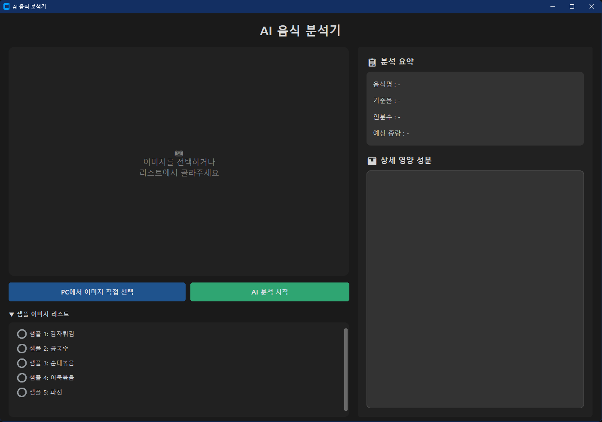
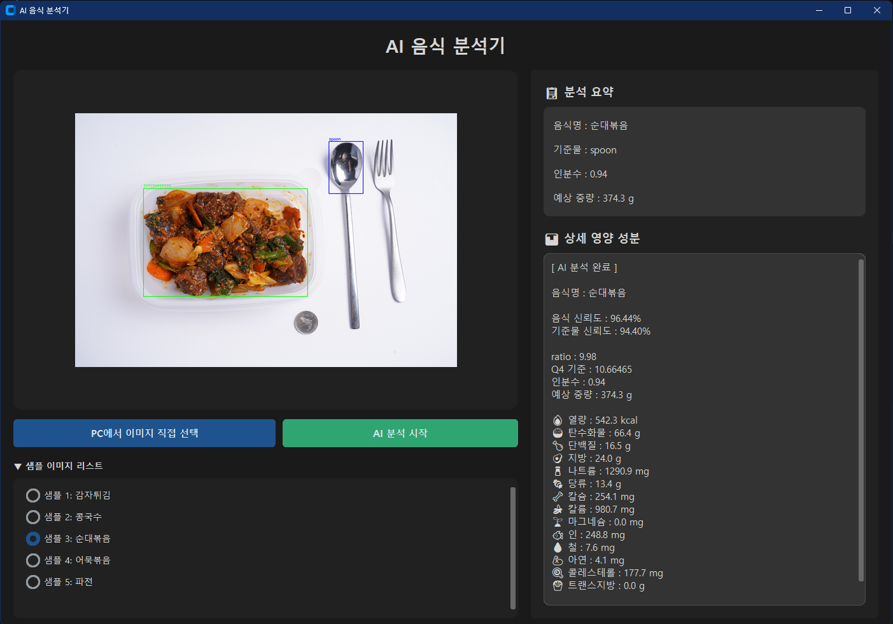
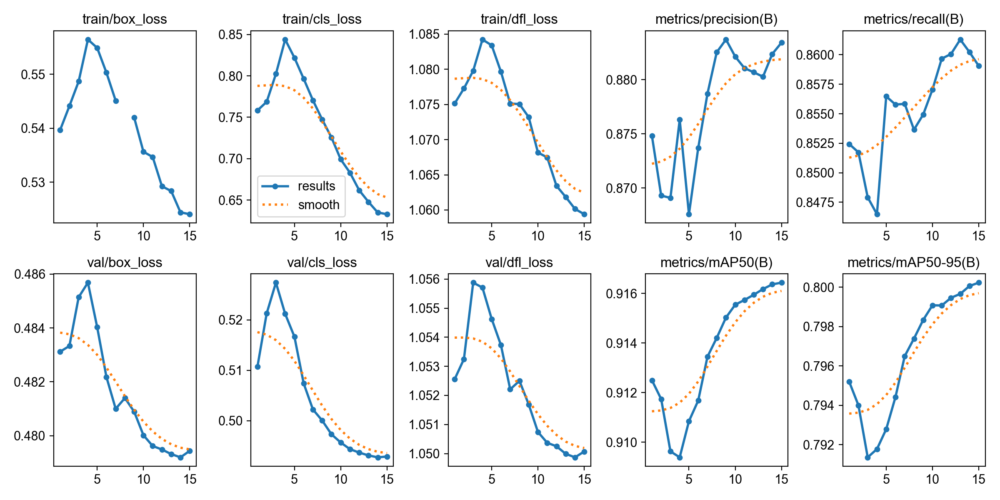
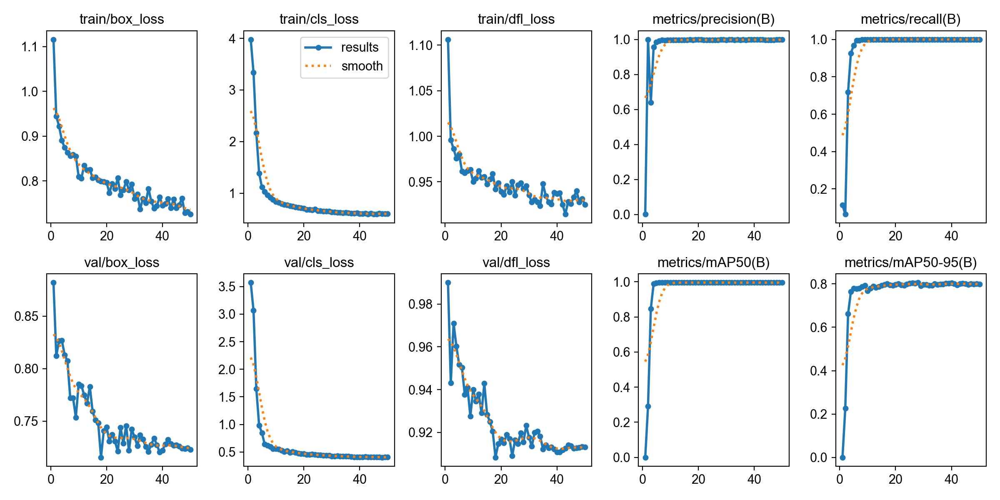

# 🍱 AI Food Analyzer

> 음식 사진 한 장으로 음식 종류를 인식하고 음식량 및 영양성분을 추정하는 AI 기반 식단 분석 시스템


---

## Demo

<p align="center">
  
</p>

---

## 📖 Overview

식단 관리 서비스는 사용자가 음식명과 섭취량을 직접 입력해야 하는 불편함이 존재합니다.

본 프로젝트는 음식 이미지를 입력받아 AI가 자동으로

* 음식 종류 인식
* 음식량 추정
* 중량 계산
* 영양성분 분석

을 수행하여 사용자의 식단 기록 과정을 자동화하는 것을 목표로 합니다.

---

## 🎯 Project Goals

### 음식 자동 인식

YOLO 기반 객체 검출 모델을 활용하여 음식을 탐지합니다.

### 기준물 인식

그릇, 접시, 배달용기 등의 기준물을 검출합니다.

### 음식량 추정

음식과 기준물의 면적 비율을 이용하여 실제 섭취량을 추정합니다.

### 영양성분 계산

AI Hub 영양 데이터베이스를 활용하여 영양 정보를 제공합니다.

---

## 🏗 System Architecture

```text
Input Image
     │
     ▼
Food Detection Model
(YOLOv8s)
     │
     ▼
Reference Detection Model
(YOLOv8n)
     │
     ▼
Area Ratio Calculation
     │
     ▼
Q4 Reference Comparison
     │
     ▼
Portion Estimation
     │
     ▼
Weight Estimation
     │
     ▼
Nutrition Analysis
     │
     ▼
Result Visualization
```

---

## 🖥 Application Screen

### 메인 화면



### 분석 결과



---

## ⚙️ Tech Stack

### AI / Deep Learning

* YOLOv8
* PyTorch
* Ultralytics

### Computer Vision

* OpenCV
* Pillow

### GUI

* CustomTkinter

### Data Processing

* NumPy
* JSON

---

## 📂 Project Structure

```text
FoodAnalyzer/
│
├── app.py
├── requirements.txt
├── README.md
│
├── models/
│   ├── food_detection_model.pt
│   └── Reference_detection_model.pt
│
├── json/
│   ├── food_q4_reference.json
│   ├── category_q4_reference.json
│   └── food_nutrition_db.json
│
├── test_images/
│
└── docs/
    ├── main.png
    ├── result.png
    ├── rfood_model_results.png
    └── reference_model_results.png
```

---

## 🧠 AI Models

### Food Detection Model

| Item    | Value               |
| ------- | ------------------- |
| Model   | YOLOv8s             |
| Task    | Food Detection      |
| Dataset | AI Hub Food Dataset |
| Classes | 400                 |

### Reference Detection Model

| Item    | Value               |
| ------- | ------------------- |
| Model   | YOLOv8n             |
| Task    | Utensil Detection   |
| Classes | spoon/fork/coin     |

---

## 📏 Portion Estimation Method

### Step 1. Food Area

```python
food_area_px = food_width * food_height
```

### Step 2. Reference Area

```python
utensil_area_px = utensil_width * utensil_height
```

### Step 3. Ratio Calculation

```python
ratio = food_area_px / utensil_area_px
```

### Step 4. Portion Scale

```python
amount_scale = ratio / q4_ratio
```

### Step 5. Weight Estimation

```python
weight_g = base_weight_g * amount_scale
```

---

## 📊 Nutrition Information

분석 결과로 다음 영양성분을 제공합니다.

| Category     | Unit |
| ------------ | ---- |
| Calories     | kcal |
| Carbohydrate | g    |
| Protein      | g    |
| Fat          | g    |
| Sodium       | mg   |
| Sugar        | g    |
| Calcium      | mg   |
| Potassium    | mg   |
| Magnesium    | mg   |
| Phosphorus   | mg   |
| Iron         | mg   |
| Zinc         | mg   |
| Cholesterol  | mg   |
| Trans Fat    | g    |

---

## 📚 Dataset

### AI Hub Food Dataset

활용 데이터

* 음식 이미지 데이터
* 음식 분량(Q1~Q5) 데이터
* 음식 영양 DB

---

## 📈 Performance

### Food Detection

| Metric    | Score |
| --------- | ----- |
| Precision | 0.877 |
| Recall    | 0.847 |
| mAP50     | 0.919 |
| mAP50-95  | 0.804 |

### Food Detection Training Result


### Reference Detection

| Metric    | Score |
| --------- | ----- |
| Precision | 0.998 |
| Recall    | 1.000 |
| mAP50     | 0.995 |
| mAP50-95  | 0.803 |

### Reference Detection Training Result


---

## 🚀 Installation

### Clone Repository

```bash
git clone https://github.com/sunwoocodes/CareOn_Food_AI.git
cd CareOn_Food_AI
```

### Install Dependencies

```bash
pip install -r requirements.txt
```

---

## ▶ Run

```bash
python app.py
```

---

## ⚠️ Limitations

* Bounding Box 기반 면적 추정 방식 사용
* 음식 높이 정보 미반영
* 카메라 각도에 따른 오차 발생 가능
* 실제 중량과 차이가 발생할 수 있음

---

## 🔮 Future Work

* Segmentation 기반 음식 영역 추출
* 3D Volume Estimation
* 모바일 앱 연동
* 실시간 카메라 분석
* 클라우드 기반 서비스 구축

---

## 📄 License

This project is intended for educational and research purposes only.
